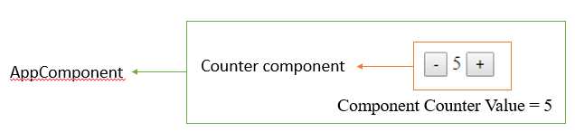

# CS569 Homework 03
## Angular Components Communication - Inputs/Outpus
## Write in a new markdown file `hw3-question1.md` the answer of the following questions:
Read the documentaion and name all Angular component lifecycle hooks? and summurize when each one of them is triggered.
  
## Coding Exercise
1. Create a new Angular application from CLI.
2. From the CLI, create a component `Counter` that has one property `counterLocalValue=0`, with inline template and style.
3. Display the `Counter` component as a direct child to `AppComponent`.
4. The `Counter` component template should have two buttons and variable bound to the `counterLocalValue` property, when the user clicks on `"-"` or `"+"` buttons the `counterLocalValue` should decrease/increase.

  
**Receive the count initial value from the parent component + emit any changes back to the parent component:**  
1. In `Counter` Component: Create an `Input` to accept the initial value of `counterLocalValue`.
2. In `Counter` Component: Create an `Output` that emits any updates of `counterLocalValue` to the parent component. 
3. In `Counter` Component: Update your `"-"` and `"+"` methods to emit the change of `counterLocalValue` to any listener.
4. In `AppComponent` Component: Pass an initial value for the `Counter` component.
5. In `AppComponent` Component: Listen to any changes emitted by the `Counter` component and log the change in the console.
  
The expected use of the `Counter` component is as follows:
```html
<Counter [init]="counterValue" (countChange)="handleChange($event)"></Counter>
```

